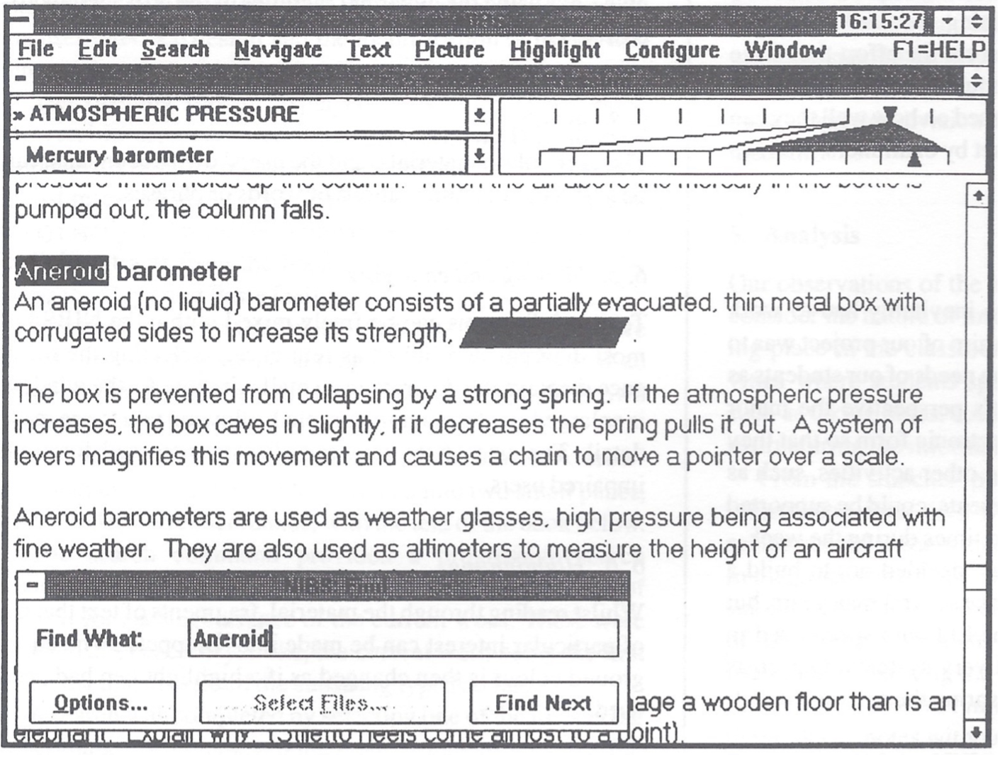
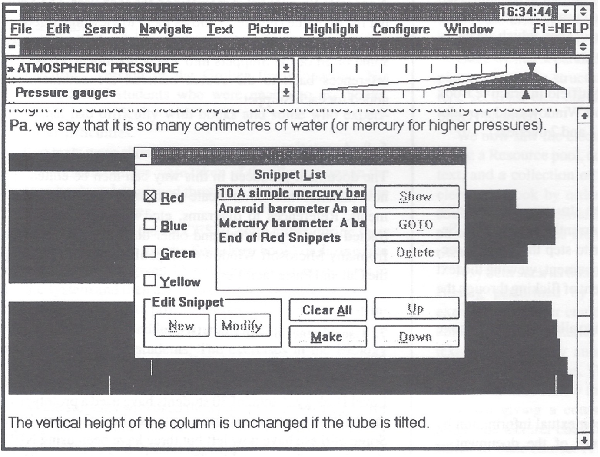

# NIBS - Nuffield Interactive Book System

A modern web implementation of the groundbreaking Nuffield Interactive Book System from the 1990s by Claude 4 (initial commit), designed to provide accessible electronic reading for students with motor disabilities.

## Overview

NIBS was originally developed at Hereward College in the 1990s to address the needs of students with physical disabilities who couldn't easily navigate traditional paper-based study materials. This modern implementation recreates the core functionality (programmed by AI using Claude's Agentic coder) by using contemporary web technologies while maintaining the original accessibility-first design philosophy.

### Status
- Currently this is just the output of a test - using the article, could Claude Code recreate the software?

## Features

### 🔍 **Intelligent Text Browser**
- Hierarchical document navigation with sections and subsections
- Visual structure map for quick orientation
- Keyboard-accessible controls throughout

### 🔎 **Advanced Search**
- Fast full-text search with contextual results
- Progressive search that updates as you type
- Click-through navigation to relevant sections

### ✂️ **Snippet Extraction**
- Highlight and extract important text passages
- Organize snippets with source attribution
- Create new documents from collected snippets

### 📝 **Integrated Note-Taking**
- Built-in note editor with auto-save
- Seamless switching between reading and writing
- Notes persist across sessions

### ♿ **Accessibility Features**
- Full keyboard navigation support
- Screen reader announcements
- Adjustable text sizing
- High contrast mode support
- Switch-accessible interface design

## Getting Started

### Prerequisites
- Node.js (version 16 or higher)
- npm or yarn package manager

### Installation

1. Clone this repository:
   ```bash
   git clone [repository-url]
   cd NIBS
   ```

2. Install dependencies:
   ```bash
   npm install
   ```

3. Start the development server:
   ```bash
   npm run dev
   ```

4. Open your browser to `http://localhost:5173`

### Building for Production

```bash
npm run build
```

The built files will be in the `dist` directory.

## Usage

### Navigation
- Use the **Structure Browser** on the left to navigate through document sections
- Select sections and subsections from the dropdown menus
- Click items in the structure map for quick navigation

### Searching
- Click the **Search** button or press `Ctrl+F` to open search mode
- Type your search terms and press Enter or click Search
- Click on search results to navigate to relevant sections

### Creating Snippets
1. Click the **Snippets** button to focus the snippets panel
2. Click the highlight button (🖍️) to enable highlight mode
3. Select text in the main content area to create snippets
4. View and manage your snippets in the right panel

### Note-Taking
- Click the **Notes** tab in the right panel
- Use the text area to write notes
- Press `Ctrl+S` to save your notes

### Creating Documents
- Collect multiple snippets from different sections
- Click **Create Document from Snippets** to generate a study document
- The new document combines all your snippets with source attribution

## Keyboard Shortcuts

| Shortcut | Action |
|----------|--------|
| `Tab` / `Shift+Tab` | Navigate between controls |
| `Ctrl+F` | Open search mode |
| `Escape` | Close search mode |
| `Ctrl+S` | Save notes |
| `Enter` | Execute search |

## Accessibility

This application is designed with accessibility as a primary concern:

- **Keyboard Navigation**: All functionality is available via keyboard
- **Screen Reader Support**: Proper ARIA labels and live regions
- **Motor Disability Support**: Minimal movement required, large click targets
- **Visual Customization**: Adjustable text size, high contrast support
- **Reduced Motion**: Respects user preferences for reduced motion

## Historical Context

The original NIBS was described in the paper "'I can read but I can't turn the pages'" by Chris Page (1991), which detailed the challenges faced by students with motor disabilities in accessing traditional study materials. The system was revolutionary for its time, implementing features that are now standard in modern accessibility design.

### Original NIBS Interface (1990s)

**Figure 1: NIBS Text Browser and Search**


**Figure 2: NIBS Snippet Management System** Note the original article graphics did not show the highlighter pen colours!


*The original interface demonstrates the sophisticated snippet management system with color-coded categories (Red, Blue, Green, Yellow) and hierarchical text organization that inspired this modern implementation.*

Key innovations from the original system that are preserved in this implementation:
- Separation of content from structure
- Snippet-based learning workflows
- Keyboard-only operation
- Integration of reading and writing activities
- Color-coded snippet organization
- Hierarchical document navigation

## Technical Architecture

- **Frontend**: Vanilla JavaScript with modern ES6+ features
- **Build Tool**: Vite for fast development and optimized builds
- **Styling**: CSS3 with accessibility-first design
- **Storage**: localStorage for persistent notes and preferences
- **Standards**: WCAG 2.1 AA compliance

## Contributing

We welcome contributions that improve accessibility and educational functionality. Please ensure any changes maintain keyboard accessibility and screen reader compatibility.

## License

MIT License - see LICENSE file for details.

## Acknowledgments

- Original NIBS development team at Hereward College
- Office Workstations Limited (OWL) for the original implementation
- Chris Page for the foundational research and design

---

*"The students wanted to be able to study independently, and this led to a two-year research programme, conducted between 1987 and 1989, into alternative solutions for meeting this need."* - From the original NIBS paper
