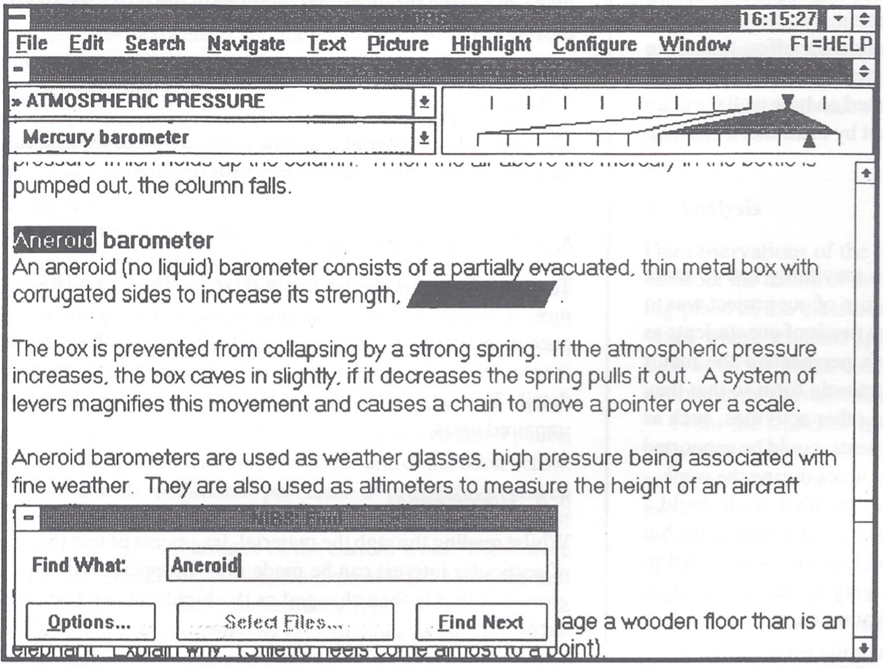
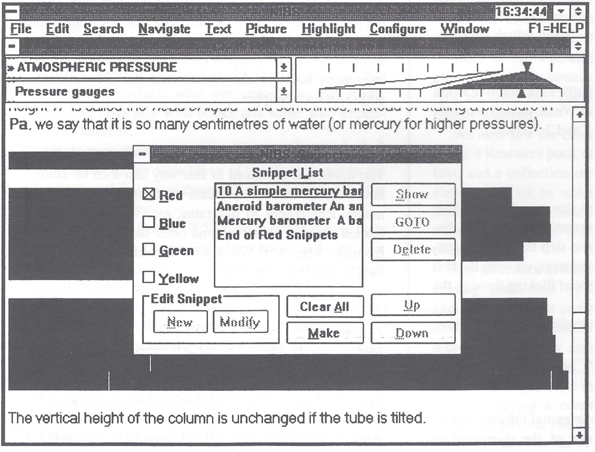

# NIBS Historical Documentation

## Original NIBS Screenshots (1990s)

### Figure 1: Text Browser and Search Interface
**File**: `figure1-original-nibs-search.png`

**Description**: Shows the original NIBS interface displaying content about atmospheric pressure and barometers. Key features visible:
- Text browser with atmospheric pressure content
- Search functionality with "Find What: Aneroid" 
- Navigation controls (Options, Select Files, Find Next)
- Hierarchical content structure
- Classic 1990s interface design

### Figure 2: Snippet Management System  
**File**: `figure2-original-nibs-snippets.png`

**Description**: Demonstrates the sophisticated snippet organization system:
- **Snippet List Dialog** with color-coded categories:
  - ☑️ Red (selected)
  - ☐ Blue  
  - ☐ Green
  - ☐ Yellow
- **Snippet Content Preview**: Shows extracted text about barometers
- **Management Controls**: 
  - Edit Snippet (New, Modify)
  - Navigation (Up, Down, GOTO)
  - Actions (Show, Delete, Clear All, Make)
- **Content Context**: Text about atmospheric pressure measurements

## Modern Implementation Inspiration

These original interfaces directly inspired the modern NIBS features:

1. **Color-coded Snippet Organization** → Modern snippet categories and tagging
2. **Hierarchical Text Navigation** → Structure browser with sections/subsections  
3. **Integrated Search** → Fast full-text search with contextual results
4. **Snippet Management** → Modern snippet creation and document generation
5. **Accessibility-First Design** → Keyboard navigation and screen reader support

## Technical Evolution

**1990s NIBS:**
- Desktop application (likely Windows/DOS)
- File-based content storage
- Native GUI controls
- Switch-accessible interface

**Modern NIBS:**
- Web-based application
- JSON-structured content
- Modern web standards (HTML5, CSS3, ES6+)
- Progressive web app capabilities
- Cross-platform accessibility
